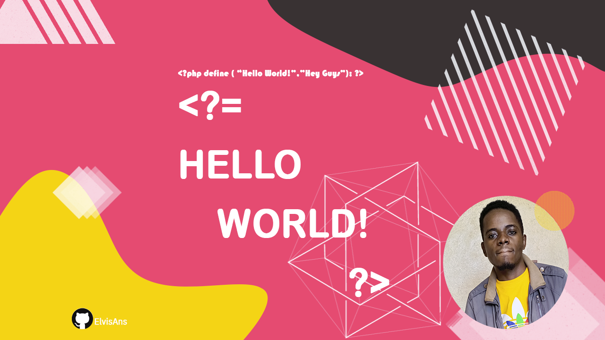

Hi there 👋
------------

**Im Elvis, someone who loves to code and innovate!**

I feel peacefull when figuring out new things.

🌱 I’m currently learning at PluralSight, IBM Digital Nation and at DataCamp, just to name a few. 

> I daily consider myself as an incomplete guy

⚡ Fun fact: [Deejaying](https://fr.virtualdj.com/user/ElvisAns/), [Designing](https://pin.it/1UaZ9U2) and Watching football

About myself
------------
  
- 🎓 &nbsp; I've graduate in Electronics and Telecommunication Technology, Kigali Independent University (ULK), class of 2019-2020
- 💼 &nbsp; I Work at **[CTL.Co sarl](https://www.ctlcosarl.com)** as an Engineering Manager in IT & Electronics Departement
- 🌱 &nbsp; Passionate about Artificial Intelligence, i'm an active learner at IBM Cloud
- ✍️ &nbsp; I love PHP 

<!--
**ElvisAns/ElvisAns** is a ✨ _special_ ✨ repository because its `README.md` (this file) appears on your GitHub profile.

Here are some ideas to get you started:

- 🔭 I’m currently working on ...
- 🌱 I’m currently learning ...
- 👯 I’m looking to collaborate on ...
- 🤔 I’m looking for help with ...
- 💬 Ask me about ...
- 📫 How to reach me: ...
- 😄 Pronouns: ...
- ⚡ Fun fact: ...
-->
